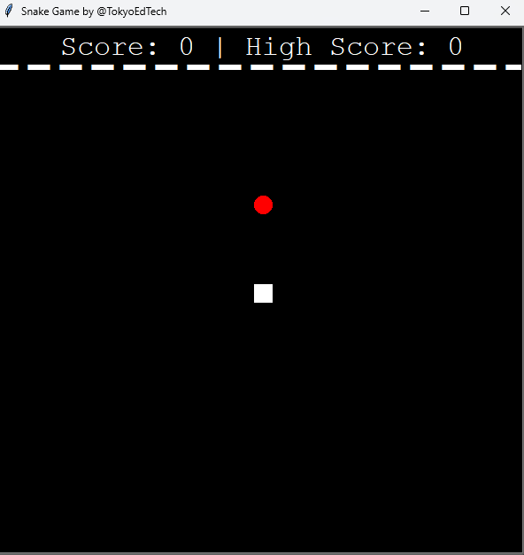

# Project-1

# Created a Python-based game using the following modules:

# Turtle: It’s a pre-installed Python library that lets users create shapes and pictures using a virtual canvas.
# Time: Used this function to count how many seconds have passed since the epoch.
# Random: This function generates random numbers in Python by using the random module.

# The following is an image of how the game looks when the program runs.
